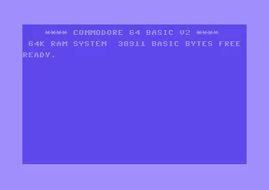

# Intcode for Commodore 64

_Intcode_ is the fictional machine language from [Advent Of Code
2019](https://adventofcode.com/2019).

This repository contains some experiments for implementing an interpreter for
Intcode on the Commodore 64.

6502 wizards will surely spot many inefficiencies that could be improved 😅

## Current Status

Part 1 of day 2 is implemented. Loading the program will load the interpreter
and _gravity assist program_ into memory. Entering `RUN` in BASIC after the
program is loaded will execute the _gravity assist program_ using the
interpreter and print the output (in hexadecimal).



The interpreter appears slower than it really is because it prints the name of
each Intcode opcode as it executes it.

## Compiling

You will need:

- [cc65 compiler](https://github.com/cc65/cc65)
- [VICE emulator](https://vice-emu.sourceforge.io/)

Binaries are built using the assembler from the cc65 compiler toolkit. A D64
disk image is also built using the `c1541` tool that is bundled with VICE.

See the Makefile for more information.

Run `make` to build both the program binary and a disk image.

```
$ make
```

## Running

The program binary file can be loaded directly by the VICE emulator.

```
$ x64sc day2part1.prg
```

Alternatively, you can launch VICE with the disk image inserted into the disk drive.

```
$ x64sc -8 day2part1.d64
```
